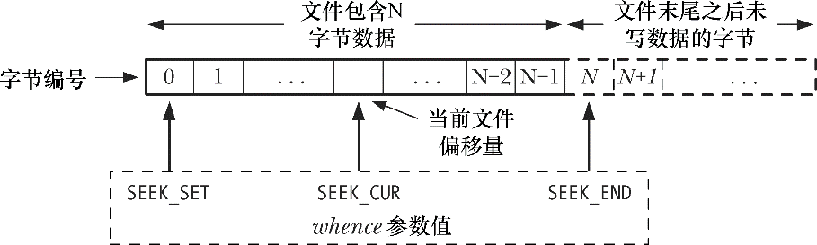

# 通用的I/O模型

## [0x00]概述

所有执行I/O操作的系统调用都以文件描述符，一个非负整数(通常是小整数)，来指代打开的文件。文件描述符用以表示所有类型已打开文件，包括管道(pipe)、FIFO、socket、终端、设备和普通文件。针对每个进程，文件描述符都自成一套。

按照惯例，大多数程序都希望能够使用3种标准的文件描述符，如表1所示。在程序开始运行之前，shell代表程序打开这3个文件描述符。更确切的说，程序继承了shell文件描述符的副本，这3个描述符始终是打开的。如果命令行指定输入/输出进行重定向操作，那么shell会对文件描述符做适当修改，然后再启动程序。

| 文件描述符 |   用途   |   POSIX名称   | stdio流 |
| :--------: | :------: | :-----------: | :-----: |
|     0      | 标准输入 | STDIN_FILENO  |  stdin  |
|     1      | 标准输出 | STDOUT_FILENO | stdout  |
|     2      | 标准错误 | STDERR_FILENO | stderr  |

在程序指代这些描述符时，可以使用数字(0、1、2)表示，或者采用<unistd.h>所定义的POSIX标准名称。

虽然stdin、stdout和stderr变量在程序初始化时对用于指代进程的标准输入、标准输出和标准错误，但是调用freopen()库函数可以使这些变量指代其他任何文件对象。作为其操作的一部分，freopen()可以在将流(stream)重新打开之际一并更换隐匿其中的文件描述符。换言之，针对stdout调用freopen()函数后，无法保证stdout变量仍然为1。

## [0x01]通用I/O

UNIX I/O模型的显著特点之一是其输入输出的通用性概念。这意味着使用4个同样的系统调用open()、read()、write()和close()可以对所有类型的文件执行I/O操作，包括终端之类的设备。因此，仅使用这些系统调用编写程序，将对任何类型的文件有效。

要实现通用I/O，就必须确保每一个文件系统和设备驱动程序都实现了相同的I/O系统调用集。由于文件系统或设备锁特有的操作细节在内核中处理，在编程时通常可以忽略设备专有的因素。一旦应用程序要访问文件系统或设备的专有功能时，可以选择ioctl系统调用，这个调用为通用I/O模型之外的专有特性提供了访问接口。

## [0x02]打开一个文件：open()

open()调用既能打开一个已经存在的文件，也能创建并打开一个新文件。

```c
#include <sys/stat.h>
#include <fcntl.h>
int open(const char *pathname, int flags, .../* mode_t mode */);
		returns file descriptor on success, or -1 on error.
```

要打开的文件由参数pathname来标识。如果pathname是一个符号链接，会对其进行街引用。如果调用成功，open()将返回一个文件描述符，用于在后续函数调用中指代该文件。如果发生错误，则返回-1，并将errno设置为相应的错误标志。

参数flags是位掩码，用于指定文件的访问模式，可选择下表所示的常量之一。(早期的UNIX实现中使用数字0、1、2，而不是下表中列的常量名称。大多数现代UNIX实现将这些常量定义为上述相应数字。由此可见，O_RDWR并不等同于O_RDONLY | O_WRONLY，后者组合属于逻辑错误。

| 访问模式 |       描述       |
| :------: | :--------------: |
| O_RDONLY | 以只读的方式打开 |
| O_WRONLY | 以只写的方式打开 |
|  O_RDWR  | 以读写的方式打开 |

当调用open()创建新文件时，位掩码参数mode指定了文件的访问权限。(SUSv3规定，mode的数据类型mode_t属于整数类型)如果open()并未指定O_CREAT标志，则可以省略mode参数。

### open()调用锁返回的文件描述符数值

SUSv3规定，如果调用open()成功，必须保证他的返回值为进程未使用文件描述符中数值最小者。可以利用这个特点以特定文件描述符打开一个文件。

### open()调用中的flags参数

在open()调用例子中，flags参数除了使用文件访问标志外，还使用了其他操作标志(O_CREAT、O_TRUNC和O_APPEND)。现在讲详细介绍flags参数。下表总结了可参与flags参数逐位或运算(|)的一整套常量。最后一列显示常量标准化与SUSv3还是SUSv4。

|    标志     |                            用途                             | 统一UNIX规范版本 |
| :---------: | :---------------------------------------------------------: | ---------------- |
|  O_RDONLY   |                       以只读方式打开                        | v3               |
|  O_WRONLY   |                       以只写方式打开                        | v3               |
|   O_RDWR    |                       以读写方式打开                        | v3               |
| O_CLOSEXEC  |        设置close-on-exec标志(自Linux 2.6.32版本开始)        | v4               |
|   O_CREAT   |                     若文件不存在则创建                      | v3               |
|   O_DRECT   |                      无缓冲的输入/输出                      |                  |
| O_DRECTORY  |                如果pathname不是目录，则失败                 | v4               |
|   O_EXECL   |            结合O_CREAT参数使用，专门用于创建文件            | v3               |
| O_LARGEFILE |             在32位系统中使用这个标志打开大文件              |                  |
|  O_NOATIME  | 调用read()时，不修改文件最近访问时间(自Linux 2.6.8版本开始) |                  |
|  O_NOCTTY   |        不要让pathname(所指向的终端设备)成为控制终端         | v3               |
| O_NOFOLLOW  |                    对符号链接不予解引用                     | v4               |
|   O_TRUNC   |                  截断已有文件，使其长度为0                  | v3               |
|  O_APPEND   |                    总在文件尾部追加数据                     | v3               |
|   O_ASYNC   |          当I/O操作可行时，产生信号(signal)通知进程          |                  |
|   O_DSYNC   |      提供同步的I/O数据完整性(自 Linux 2.6.33版本开始)       | v3               |
| O_NONBLOCK  |                      以非阻塞方式打开                       | v3               |
|   O_SYNC    |                     以同步方式写入文件                      | v3               |

上表中常量分为如下几组：

- 文件访问模式标志：先前描述的O_RDONLY、O_WRONLY和O_RDWR标志都在这列，调用open()时，上述三者在flags参数中不能同时使用，只能指定其中一种。调用fcntl()的F_GETFL操作能够检索文件的访问模式。
- 文件创建标志：这些标志在上表中位于第二部分，控制范围不局限于open()调用行为的方方面面，还涉及后续I/O操作的各个选项。这些标志不能检索，也无法修改。
- 已打开文件的状态标志：这些标志是上表中的剩余部分，使用fcntl()的F_GETFL和F_SETFL操作可以分别检索和修改这类标志。有事干脆将其称之为文件状态标志。

始于内核版本2.6.22，读取位于/proc/PID/fdinfo目录下的linux系统专有文件，可以获取系统内任一进程中文件描述符的相关信息。针对进程中每一个已经打开的文件描述符，该目录下都有相应的文件，一对应文件描述符的数值命名。文件中的pos字段表示当前的文件偏移量。而flags字段则为一个8进制数，表征文件访问标志和已打开文件的状态标志。

- O_ASYNC 

当对于open()调用所返回的文件描述符可以实施 I/O 操作时，系统会产生一个信号通知进程。这一特性，也被称为信号驱动I/O，仅对特定类型的文件有效，诸如终端、FIFOS及socket。（在SUSv3并未规定O_ASYNC标志，但大多数UNIX实现都支持此标志或者老版本中与其等效的FASYNC标志。）在Linux中，调用open()时指定O_ASYNC标志没有任何实质效果。要启用信号驱动I/O特性，必须调用fcntl()的F_SETFL操作来设置O_ASYNC标志（见5.3节）。（其他一些UNIX系统的实现有类似行为。）关于O_ASYNC标志的更多内容请参考63.3节。

- O_CLOEXEC（自Linux 2.6.23版本开始支持）

为新（创建）的文件描述符启用close-on-flag标志（FD_CLOEXEC）。使用O_CLOEXEC标志（打开文件），可以免去程序执行fcntl()的F_GETFD和F_SETFD操作来设置close-on-exec标志的额外工作。在多线程程序中执行fcntl() 的F_GETFD和F_SETFD操作有可能导致竞争状态，而使用O_CLOEXEC标志则能够避免这一点。可能引发竞争的场景是：线程某甲打开一文件描述符，尝试为该描述符标记close-on-exec标志，于此同时，线程某乙执行fork()调用，然后调用exec()执行任意一个程序。（假设在某甲打开文件描述符和调用fcntl()设置close-on-exec标志之间，某乙成功地执行了fork()和exec()操作。）此类竞争可能会在无意间将打开的文件描述符泄露给不安全的程序。

- O_CREAT

如果文件不存在，创建一个新的空文件。及时文件以只读方式打开，此标志依然有效。如果在open()调用中指定O_CREAT标志，那么嗨需要提供mode参数，否则，会将新文件的权限设置为栈中的某个随机值。

- O_DIRECT

无系统缓冲的文件I/O操作。该特性将在13.6节中详述。为使O_DIRECT标志的常量定义在<fcntl.h>中有效，必须定义_GNU_SOURCE功能测试宏。

- O_DIRECTORY

如果pathname参数并非目录，将返回错误（错误号errno为ENOTDIR）。这一标志是专为实现opendir()函数而设计的扩展标志。为使O_DIRECTORY标志的常量定义在<fcntl.h>中有效，必须定义_GNU_SOURCE功能测试宏。

- O_DSYNC（自Linux 2.6.33版本开始支持）

根据同步I/O数据完整性的完成要求 来执行文件写操作。

- O_EXCL

此标志与 O_CREAT 标志结合使用表明如果文件已经存在，则不会打开文件，且 open()调用失败，并返回错误，错误号errno为EEXIST。换言之，此标志确保了调用者（open( )的调用进程）就是创建文件的进程。检查文件存在与否和创建文件这两步属于同一原子操作。如果在flags参数中同时指定了O_CREAT和O_EXCL标志，且pathname参数是符号链接，则open()函数调用失败（错误号errno为EEXIST）。SUSv3之所以如此规定，是要求有特权的应用程序在已知目录下创建文件，从而消除了如下安全隐患，使用符号链接打开文件会导致在另一位置创建文件（例如，系统目录）。

- O_LARGEFILE

支持以大文件方式打开文件。在32位操作系统中使用此标志，以支持大文件操作。尽管在SUSv3中没有规定这一标志，但其他一些UNIX实现都支持这一特性。此标志在诸如Alpha、IA-64之类的64位Linux实现中是无效的。更多的内容将在5.10节中讨论。

- O_NOATIME（自Linux 2.6.8版本开始）

在读文件时，不更新文件的最近访问时间（15.1 节中所描述的st_atime属性）。要使用该标志，要么调用进程的有效用户ID必须与文件的拥有者相匹配，要么进程需要拥有特权（CAP_FOWNER）。否则，open()调用失败，并返回错误，错误号errno为EPERM。（事实上，如9.5节所述，对于非特权进程，当以O_NOATIME标志打开文件时，与文件用户ID必须匹配的是进程的文件系统用户ID，而非进程的有效用户ID。）此标志是Linux特有的非标准扩展。要从<fcntl.h>中启用此标志，必须定义GNU_SOURCE功能测试宏。O_NOATIME标志的设计旨在为索引和备份程序服务。该标志的使用能够显著减少磁盘的活动量，省却了既要读取文件内容，又要更新文件i-node结构中最近访问时间的繁琐，进而节省了磁头在磁盘上的反复寻道时间（14.4 节）。mount()函数中MS_NOATIME标志（14.8.1节）和FS_NOATIME_FL标志（15.5节）与O_NOATIME标志功能相似。

- O_NOCTTY

如果正在打开的文件属于终端设备，O_NOCTTY标志防止其成为控制终端。如果正在打开的文件不是终端设备，则此标志无效。

- O_NOFOLLOW

通常，如果pathname参数是符号链接，open()函数将对pathname参数进行解引用。一旦在open()函数中指定了O_NOFOLLOW标志，且pathname参数属于符号链接，则open()函数将返回失败（错误号errno为ELOOP）。此标志在特权程序中极为有用，能够确保open()函数不对符号链接进行解引用。为使O_NOFOLLOW标志在<fcntl.h>中有效，必须定义_GNU_SOURCE功能测试宏。

- O_NONBLOCK

以非阻塞方式打开文件。

- O_SYNC

以同步I/O方式打开文件。

- O_TRUNC

如果文件已经存在且为普通文件，那么将清空文件内容，将其长度置0。在Linux下使用此标志，无论以读、写方式打开文件，都可清空文件内容（在这两种情况下，都必须拥有对文件的写权限）。SUSv3对O_RDONLY与O_TRUNC标志的组合未作规定，但多数其他UNIX实现与Linux的而处理方式相同。

### open()函数的错误

若打开文件时发生错误，open()将返回−1，错误号errno标识错误原因。以下是一些可能发生的错误（除了在上节参数描述中已经提及的错误之外）。

- EACCES

文件权限不允许调用进程以flags参数指定的方式打开文件。无法访问文件，其可能的原因有目录权限的限制、文件不存在并且也无法创建该文件。

- EISDIR

所指定的文件属于目录，而调用者企图打开该文件进行写操作。不允许这种用法。（另一方面，在某些场合中，打开目录进行读操作是必要的。18.11节将举例说明。）

- EMFILE

进程已打开的文件描述符数量达到了进程资源限制所设定的上限。

- ENFILE

文件打开数量已经达到系统允许的上限。

- ENOENT

要么文件不存在且未指定O_CREAT标志，要么指定了 O_CREAT标志，但pathname参数所指定路径的目录之一不存在，或者pathname参数为符号链接，而该链接指向的文件不存在（空链接）。

- EROFS

所指定的文件隶属于只读文件系统，而调用者企图以写方式打开文件。

- ETXTBSY

所指定的文件为可执行文件（程序），且正在运行。系统不允许修改正在运行的程序（比如以写方式打开文件）。（必须首先终止程序运行，然后方可修改可执行文件。）

后续在描述其他系统调用或库函数时，一般不会再以上述方式展现可能发生的一系列错误。（每个系统调用或库函数的错误列表可从相关操作手册中查询获得。）采用上述方式原因有二，一是因为open()是本书详细描述的首个系统调用，而上述列表表明任一原因都有可能导致系统调用或库函数的调用失败。二是open()调用失败的具体原因列表本身就颇为值得玩味，它展示了影响文件访问的若干因素，以及访问文件时系统所执行的一系列检查。（上述错误列表并不完整，更多open()调用失败的错误原因请查看open(2)的操作手册。）

## [0x03]creat()系统调用

在早期的UNIX实现中，open()只有两个参数，无法创建新文件，而是使用creat()系统调用来创建并打开一个新文件。

```c
#include <fcntl.h>

int creat(const char *pathname, mode_t mode);
							Returns file descriptor, or -1 on error.
```

creat()系统调用根据pathname参数创建并打开一个文件，若文件已存在，则打开文件，并清空文件内容，将其长度清0。creat()返回一文件描述符，供后续系统调用使用。creat()系统调用等价于如下open()调用：

`fd = open(pathname, O_WRONLY|O_CREAT|O_TRUNC, mode);`

尽管creat()在一些老旧程序的代码中还时有所见，但由于open()的flags参数能对文件打开方式提供更多控制（例如：可以指定O_RDWR标志，代替O_WRONLY标志），对creat()的使用现在已不多见。

## [0x04]读取文件内容：read()

read()系统调用从文件描述符fd所指代的打开文件中读取数据。

```c
#include <unistd.h>

ssize_t read(int fd, void *buf, size_t count);
					Returns number of bytes read, 0 on EOF, or -1 on error
```

系统调用不会分配内存缓冲区用以返回信息给调用者。所以，必须预先分配大小合适的缓冲区并将缓冲区指针传递给系统调用。与此相反，有些库函数却会分配内存缓冲区用以返回信息给调用者。

如果read()调用成功，将返回实际读取的字节数，如果遇到文件结束（EOF）则返回0，如果出现错误则返回-1。ssize_t数据类型属于有符号的整数类型，用来存放（读取的）字节数或-1（表示错误）。

一次read()调用所读取的字节数可以小于请求的字节数。对于普通文件而言，这有可能是因为当前读取位置靠近文件尾部。

当read()应用于其他文件类型时，比如管道、FIFO、socket或者终端，在不同环境下也会出现read()调用读取的字节数小于请求字节数的情况。例如，默认情况下从终端读取字符，一遇到换行符（\n），read()调用就会结束。在后续章节论及其他类型文件时，会再次针对这些情况进行探讨。

使用read()从终端读取一连串字符，我们也许期望下面的代码会起作用：

```c
#define MAX_READ 20
char buffer[MAX_READ];

if(read(STDIN_FILENO, buffer, MAX_READ) == -1)
  errExit("read");
printf("the input data was: %s\n", buffer);
```

这段代码的输出可能会很奇怪，因为输出结果除了实际输入的字符串外还会包括其他字符。这是因为read()调用没有在printf()函数打印的字符串尾部添加一个表示终止的空字符。思索片刻就会意识到这肯定是症结所在，因为read()能够从文件中读取任意序列的字节。有些情况下，输入信息可能是文本数据，但在其他情况下，又可能是二进制整数或者二进制形式的C语言数据结构。read()无从区分这些数据，故而也无法遵从C语言对字符串处理的约定，在字符串尾部追加标识字符串结束的空字符。如果输入缓冲区的结尾处需要一个表示终止的空字符，必须显式追加。

```c
char buffer[MAX_READ + 1];
size_t numRead;

numRead = read(STDIN_FILENO, buffer, MAX_READ);
if(numRead == -1)
  errExit("read");

buffer[numRead] = '\0';
printf("the input data was:%s\n", buffer);
```

由于表示字符串终止的空字符需要一个字节的内存，所以缓冲区的大小至少要比预计读取的最大字符串长度多出1个字节。

## [0x05]数据写入文件：write()

write()系统调用将数据写入一个已打开的文件中。

```c
#include <unistd.h>

ssize_t write(int fd, void *buffer, size_t count);
						Returns number of bytes writen, or -1 on error.
```

write()调用的参数含义与read()调用相类似。buffer参数为要写入文件中数据的内存地址，count参数为欲从buffer写入文件的数据字节数，fd参数为一文件描述符，指代数据要写入的文件。

如果write()调用成功，将返回实际写入文件的字节数，该返回值可能小于count参数值。这被称为“部分写”。对磁盘文件来说，造成“部分写”的原因可能是由于磁盘已满，或是因为进程资源对文件大小的限制。

对磁盘文件执行I/O操作时，write()调用成功并不能保证数据已经写入磁盘。因为为了减少磁盘活动量和加快write()系统调用，内核会缓存磁盘的I/O操作，第13章将会详加介绍。

## [0x06]关闭文件：close()

close()系统调用关闭一个打开的文件描述符，并将其释放回调用进程，供该进程继续使用。当一进程终止时，将自动关闭其已打开的所有文件描述符。

```c
#include <unistd.h>

int close(int fd);
```

显式关闭不再需要的文件描述符往往是良好的编程习惯，会使代码在后续修改时更具可读性，也更可靠。进而言之，文件描述符属于有限资源，因此文件描述符关闭失败可能会导致一个进程将文件描述符资源消耗殆尽。在编写需要长期运行并处理大量文件的程序时，比如shell或者网络服务器软件，需要特别加以关注。

像其他所有系统调用一样，应对close()的调用进行错误检查，如下所示：

```c
if(close(fd) == -1)
  errExit("close");
```

上述代码能够捕获的错误有：企图关闭一个未打开的文件描述符，或者两次关闭同一文件描述符，也能捕获特定文件系统在关闭操作中诊断出的错误条件。

针对特定文件系统的错误，NFS（网络文件系统）就是一例。如果NFS出现提交失败，这意味着数据没有抵达远程磁盘，随之将这一错误作为close()调用失败的原因传递给应用系统。

## [0x07]改变文件偏移量：lseek()

对于每个打开的文件，系统内核会记录其文件偏移量，有时也将文件偏移量称为读写偏移量或指针。文件偏移量是指执行下一个read()或write()操作的文件起始位置，会以相对于文件头部起始点的文件当前位置来表示。文件第一个字节的偏移量为0。

文件打开时，会将文件偏移量设置为指向文件开始，以后每次read()或write()调用将自动对其进行调整，以指向已读或已写数据后的下一字节。因此，连续的read()和write()调用将按顺序递进，对文件进行操作。

针对文件描述符fd参数所指代的已打开文件，lseek()系统调用依照offset和whence参数值调整该文件的偏移量。

```c
#include <sys/types.h>
#include <unistd.h>

off_t lseek(int fd, off_t offset, int whence);
					Returns new file offset if successful, or -1 on error.
```

offset参数指定了一个以字节为单位的数值。（SUSv3规定off_t数据类型为有符号整型数。）whence参数则表明应参照哪个基点来解释offset参数，应为下列其中之一：

- SEEK_SET

将文件偏移量设置为从文件头部起始点开始的offset个字节。

- SEEK_CUR

相对于当前文件偏移量，将文件偏移量调整offset个字节 。

- SEEK_END

将文件偏移量设置为起始于文件尾部的offset个字节。也就是说，offset参数应该从文件最后一个字节之后的下一个字节算起。



在早期的UNIX实现中，whence参数用整数0、1、2来表示，而非正文中显示的SEEK_*常量。BSD的早期版本使用另一套命名：L_SET、L_INCR和L_XTND来表示whence参数。

如果whence参数值为SEEK_CUR或SEEK_END，offset参数可以为正数也可以为负数；如果whence参数值为SEEK_SET，offset参数值必须为非负数。

lseek()调用成功会返回新的文件偏移量。下面的调用只是获取文件偏移量的当前位置，并没有修改它。

`curr = lseek(fd, 0, SEEK_CUR);`

有些UNIX系统（Linux不在此列）实现了非标准的tell(fd)函数，其调用目的与上述lseek()相同。

这里给出了lseek()调用的其他一些例子，在注释中说明了将文件偏移量移到的具体位置。

```c
lseek(fd, 0, SEEK_SET);
lseek(fd, 0, SEEK_END);
lseek(fd, -1, SEEK_END);
lseek(fd, -10, SEEK_CUR);
lseek(fd, 10000, SEEK_END);
```

lseek()调用只是调整内核中与文件描述符相关的文件偏移量记录，并没有引起对任何物理设备的访问。

lseek()并不适用于所有类型的文件。不允许将lseek()应用于管道、FIFO、socket或者终端。一旦如此，调用将会失败，并将errno置为ESPIPE。另一方面，只要合情合理，也可以将lseek()应用于设备。例如，在磁盘或者磁带上查找一处具体位置。

lseek()调用名中的l源于这样一个事实：offset参数和调用返回值的类型起初都是long型。早期的UNIX系统还提供了seek()系统调用，当时这两个值的类型为int型。

### 文件空洞

如果程序的文件偏移量已然跨越了文件结尾，然后再执行I/O操作，将会发生什么情况？read()调用将返回0，表示文件结尾。有点令人惊讶的是，write()函数可以在文件结尾后的任意位置写入数据。

从文件结尾后到新写入数据间的这段空间被称为文件空洞。从编程角度看，文件空洞中是存在字节的，读取空洞将返回以0（空字节）填充的缓冲区。

然而，文件空洞不占用任何磁盘空间。直到后续某个时点，在文件空洞中写入了数据，文件系统才会为之分配磁盘块。文件空洞的主要优势在于，与为实际需要的空字节分配磁盘块相比，稀疏填充的文件会占用较少的磁盘空间。核心转储文件（core dump）（见22.1节）是包含空洞文件的常见例子。块的大小取决于文件系统，通常是1024字节、2048字节、4096字节。如果空洞的边界落在块内，而非恰好落在块边界上，则会分配一个完整的块来存储数据，块中与空洞相关的部分则以空字节填充。

大多数“原生”UNIX文件系统都支持文件空洞的概念，但很多“非原生”文件系统（比如，微软的VFAT）并不支持这一概念。不支持文件空洞的文件系统会显式地将空字节写入文件。

空洞的存在意味着一个文件名义上的大小可能要比其占用的磁盘存储总量要大（有时会大出许多）。向文件空洞中写入字节，内核需要为其分配存储单元，即使文件大小不变，系统的可用磁盘空间也将减少。这种情况并不常见，但也需要了解。

SUSv3的函数posix_fallocate(fd, offset, len)规定，针对文件描述符fd所指代的文件，能确保按照由offset参数和len参数所确定的字节范围为其在磁盘上分配存储空间。这样，应用程序对文件的后续write()调用不会因磁盘空间耗尽而失败（否则，当文件中一个空洞被填满后，或者因其他应用程序消耗了磁盘空间时，都可能因磁盘空间耗尽而引发此类错误）。在过去，glibc库在实现posix_fallocate()函数时，通过向指定范围内的每个块写入一个值为0的字节以达到预期结果。自内核版本2.6.23开始，Linux系统提供了fallocate()系统调用，能更为高效地确保所需存储空间的分配。当fallocate()调用可用时，glibc库会利用其来实现posix_fallocate()函数的功能。

对于文件空洞不占用磁盘空间的说法需要稍微限定一下。在大多数文件系统中，文件空间的分配是以块为单位的。

## [0x08]通用I/O模型以外的操作：ioctl()

在本章上述通用I/O模型之外，ioctl()系统调用有为执行文件和设备操作提供了一种多用途机制。

```c
#include <sys/ioctl.h>
int ioctl(int d, int request, ...);
			Vlaue returned on success depends on request, or -1 on error
```

fd参数为某个设备或文件已打开的文件描述符，request参数指定了将在fd上执行的控制操作。具体设备的头文件定义了可传递给request参数的常量。

ioctl()调用的第三个参数采用了标准C语言的省略符号（...）来表示（称之为argp），可以是任意数据类型。ioctl()根据request的参数值来确定argp所期望的类型。通常情况下，argp是指向整数或结构的指针，有些情况下，不需要使用argp。

SUSv3为ioctl()制定的唯一规定是针对流（STREAM）设备的控制操作。（流是System V操作系统中的特性。尽管为其开发有一些插件，主流的Linux内核并不支持该特性。）本书述及的ioctl()的其他操作都不在SUSv3的规范之列。然而，从早期版本开始，ioctl()调用就是UNIX系统的一部分，因此本书所描述的几个ioctl()操作在许多其他UNIX系统中都已实现。在讨论ioctl()调用的各个操作时，会点出存在的可移植性问题。