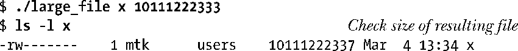

# 深入探究文件I/O

## [0x00]原子操作竞争条件

在探究系统调用时会反复涉及原子操作的概念。所有系统调用都是以原子操作方式执行的。之所以这么说，是指内核保证了某系统调用中的所有步骤会作为独立操作而一次性加以执行，其间不会为其他进程或线程所中断。

原子性是某些操作得以圆满成功的关键所在。特别是它规避了竞争状态（race conditions）（有时也称为竞争冒险）。竞争状态是这样一种情形：操作共享资源的两个进程（或线程），其结果取决于一个无法预期的顺序，即这些进程 获得CPU使用权的先后相对顺序。

接下来，将讨论涉及文件I/O的两种竞争状态，并展示了如何使用open()的标志位，来保证相关文件操作的原子性，从而消除这些竞争状态。

### 以独占方式创建一个文件

[FileIO]中曾述及：当同时指定O_EXCL与O_CREAT作为open()的标志位时，如果要打开的文件已然存在，则open()将返回一个错误。这提供了一种机制，保证进程是打开文件的创建者。对文件是否存在的检查和创建文件属于同一原子操作。要理解这一点的重要性，请思考下列程序所示代码，该段代码中并未使用O_EXCL标志。（在此，为了对执行该程序的不同进程加以区分，在输出信息中打印有通过调用getpid()所返回的进程号。）

```c
fd = open(argv[1], O_WRONLY);
if(fd != -1){
  printf("[PID %ld] File \"%s\" already exists\n", (long)getpid(), argv[1]);
  close(fd);
}else{
  if(errno != ENOENT){
    errExit("open");
  }else{
    /* WINDOW FOR FAILURE */
    fd = open(argv[1], O_WRONLY|O_CREAT, S_IRUSER|S_IWUSER);
    if(fd == -1){
      errExit("open");
    }
    printf("[PID %ld] Created file \"%s\" exclusively\n", (long)getpid(), argv[1]);
  }
}
```

上述程序中所示的代码，除了要啰啰嗦嗦地调用open()两次外，还潜伏着一个bug。假设如下情况：当第一次调用open()时，希望打开的文件还不存在，而当第二次调用open()时，其他进程已经创建了该文件。如图5-1所示，若内核调度器判断出分配给A进程的时间片已经耗尽，并将CPU使用权交给B进程，就可能会发生这种问题。再比如两个进程在一个多CPU系统上同时运行时，也会出现这种情况。下图展示了两个进程同时执行程序清单5-1中代码的情形。在这一场景下，进程A将得出错误的结论：目标文件是由自己创建的。因为无论目标文件存在与否，进程A对open()的第二次调用都会成功。


虽然进程将自己误认为文件创建者的可能性相对较小，但毕竟是存在的，这已然将此段代码置于不可靠的境地。操作的结果将依赖于对两个进程的调度顺序，这一事实也就意味着出现了竞争状态。

为了说明这段代码的确存在问题，可以用一段代码替换上述程序的注释行“处理文件不存在的情况”，在检查文件是否存在与创建文件这两个动作之间人为制造一个长时间的等待。

```c
printf("[PID %ld] File \"%s\" doesn't exist yet \n", (long)getpid(), argv[1]);
if(argc > 1){
  sleep(5);
  printf("[PID %ld] Done sleeping\n",(long)getpid());
}
```

sleep()库函数可将当前执行的进程挂起指定的秒数。

如果同时运行程序清单5-1中程序的两个实例，两个进程都会声称自己以独占方式创建了文件。


从上面输出的倒数第二行可以发现，shell提示符里夹杂了第一个实例的输出信息。

由于第一个进程在检查文件是否存在和创建文件之间发生中断，造成两个进程都声称自己是文件的创建者。结合O_CREAT和O_EXCL标志来一次性的调用open()可以防止这种情况，因为这确保了检查文件和创建文件的步骤属于一个单一的原子(即不可中断)操作。

### 向文件尾部追加数据

用以说明原子操作必要性的第二个例子是：多个进程同时向同一个文件(例如，全局日志文件)尾部添加数据。为了达到这个目的，也许可以考虑在每个写进程中使用如下代码。

```c
if(lseek(fd, 0, SEEK_END) == -1){
  errExit("lseek");
}

if(write(fd, buf, len) != len){
  fatal("Partial/failed write");
}
```

但是，这段代码存在的缺陷与前一个例子如出一辙。如果第一个进程执行lseek()和write()之间，被执行相同的代码的第二个进程锁中断，那么这两个进程会在写入数据前，将文件偏移设置为相同位置，而当第一个进程再次获得调度时，会覆盖第二个进程已写入的数据。此时再次出现了竞争状态，因为执行的结果依赖于内核对两个进程的调度顺序。

要规避这一问题，需要将文件偏移量的移动与数据写操作纳入同一原子操作。在打开文件时加入O_APPEND标志就可以保证这一点。

有些文件系统（例如NFS）不支持 O_APPEND 标志。在这种情况下，内核会选择按如上代码所示的方式，施之以非原子操作的调用序列，从而可能导致上述的文件脏写入问题。

## [0x01]文件控制操作fcntl()

fcntl()系统调用对一个打开的文件描述符执行一系列控制操作。

```c
#include <unistd.h>
#include <fcntl.h>

int fcntl(int fd, int cmd, ... /* arg */ );
				Returns on success depends on cmd, or -1 on error.
```

cmd参数所支持的操作范围很广。本章随后各节会对其中的部分操作加以研讨，剩下的操作将在后续各章中进行论述。

fcntl()的第三个参数以省略号来表示，这意味着可以将其设置为不同的类型，或者加以省略。内核会依据cmd参数（如果有的话）的值来确定该参数的数据类型。

## [0x02]打开文件的状态标志

fcntl()的用途之一是针对一个打开的文件，获取或修改其访问模式和状态标志（这些值是通过指定open()调用的flag参数来设置的）。要获取这些设置，应将fcntl()的cmd参数设置为F_GETFL。

```c
int flags, accessMode;

flags = fcntl(fd, F_GETFL);
if(flags == -1){
  errExit("fcntl");
}
```

在上述代码之后，可以以如下代码测试文件是否以同步写方式打开：

```c
if(flags & O_SYNC){
  printf("write are synchronized\n");
}
```

SUSv3规定：针对一个打开的文件，只有通过open()或后续fcntl()的F_SETFL操作，才能对该文件的状态标志进行设置。然而在如下方面，Linux实现与标准有所偏离：如果一个程序编译时采用了5.10节所提及的打开大文件技术，那么当使用F_GETFL命令获取文件状态标志时，标志中将总是包含O_LARGEFILE标志。

判定文件的访问模式有一点复杂，这是因为O_RDONLY(0)、O_WRONLY(1)和O_RDWR(2)这3个常量并不与打开文件状态标志中的单个比特位对应。因此，要判定访问模式，需使用掩码O_ACCMODE与flag相与，将结果与3个常量进行比对，示例代码如下：

```c
accessMode = flags & O_ACCMODE;
if(accessMode == O_WRONLY || accessMode == O_RDWR){
  printf("file is writable\n");
}
```

可以使用fcntl()的F_SETFL命令来修改打开文件的某些状态标志。允许更改的标志有O_APPEND、O_NONBLOCK、O_NOATIME、O_ASYNC和O_DIRECT。系统将忽略对其他标志的修改操作。（有些其他的UNIX实现允许fcntl()修改其他标志，如O_SYNC。）

使用fcntl()修改文件状态标志，尤其适用于如下场景。

- 文件不是由调用程序打开的，所以程序也无法使用open()调用来控制文件的状态标志（例如，文件是3个标准输入输出描述符中的一员，这些描述符在程序启动之前就被打开）。
- 文件描述符的获取是通过open()之外的系统调用。比如pipe()调用，该调用创建一个管道，并返回两个文件描述符分别对应管道的两端。再比如socket()调用，该调用创建一个套接字并返回指向该套接字的文件描述符。

为了修改打开文件的状态标志，可以使用fcntl()的F_GETFL命令来获取当前标志的副本，然后修改需要变更的比特位，最后再次调用fcntl()函数的F_SETFL命令来更新此状态标志。因此，为了添加O_APPEND标志，可以编写如下代码：

```c
int flags;

flags = fcntl(fd, F_GETFL);
if(flags == -1){
  errExit("fcntl");
}
flags |= O_APPEND;
if(fcntl(fd, f_SETFL, flags) == -1){
  errExit("fcntl");
}
```

## [0x03]文件描述符和打开文件之间的关系

到目前为止，文件描述符和打开的文件之间似乎呈现出一一对应的关系。然而，实际并非如此。多个文件描述符指向同一打开文件，这既有可能，也属必要。这些文件描述符可在相同或不同的进程中打开。

要理解具体情况如何，需要查看由内核维护的3个数据结构。

- 进程级的文件描述符表。
- 系统级的打开文件表。
- 文件系统的i-node表。

针对每个进程，内核为其维护打开文件的描述符（open file descriptor）表。该表的每一条目都记录了单个文件描述符的相关信息，如下所示。

- 控制文件描述符操作的一组标志。（目前，此类标志仅定义了一个，即close-on-exec标志，将在27.4节予以介绍。）
- 对打开文件句柄的引用。

内核对所有打开的文件维护有一个系统级的描述表格（open file description table）。有时，也称之为打开文件表（open file table），并将表中各条目称为打开文件句柄（open file handle） 。一个打开文件句柄存储了与一个打开文件相关的全部信息，如下所示。

- 当前文件偏移量（调用read()和write()时更新，或使用lseek()直接修改）。
- 打开文件时所使用的状态标志（即，open()的flags参数）。
- 文件访问模式（如调用open()时所设置的只读模式、只写模式或读写模式）。
- 与信号驱动I/O相关的设置。
- 对该文件i-node对象的引用。

每个文件系统都会为驻留其上的所有文件建立一个i-node表。第14章将详细讨论i-node结构和文件系统的总体结构。这里只是列出每个文件的i-node信息，具体如下。

- 文件类型（例如，常规文件、套接字或FIFO）和访问权限。
- 一个指针，指向该文件所持有的锁的列表。
- 文件的各种属性，包括文件大小以及与不同类型操作相关的时间戳。

此处将忽略i-node在磁盘和内存中的表示差异。磁盘上的i-node记录了文件的固有属性，诸如：文件类型、访问权限和时间戳。访问一个文件时，会在内存中为i-node创建一个副本，其中记录了引用该i-node的打开文件句柄数量以及该i-node所在设备的主、从设备号，还包括一些打开文件时与文件相关的临时属性，例如：文件锁。

图5-2展示了文件描述符、打开的文件句柄以及i-node之间的关系。在下图中，两个进程拥有诸多打开的文件描述符。


在进程A中，文件描述符1和20都指向同一个打开的文件句柄（标号为23）。这可能是通过调用dup()、dup2()或fcntl()而形成的（参见5.5节）。

进程A的文件描述符2和进程B的文件描述符2都指向同一个打开的文件句柄（标号为73）。这种情形可能在调用fork()后出现（即，进程A与进程B之间是父子关系），或者当某进程通过UNIX域套接字将一个打开的文件描述符传递给另一进程时，也会发生。

此外，进程A的描述符0和进程B的描述符3分别指向不同的打开文件句柄，但这些句柄均指向i-node表中的相同条目（1976），换言之，指向同一文件。发生这种情况是因为每个进程各自对同一文件发起了open()调用。同一个进程两次打开同一文件，也会发生类似情况。

上述讨论揭示出如下要点。

- 两个不同的文件描述符，若指向同一打开文件句柄，将共享同一文件偏移量。因此，如果通过其中一个文件描述符来修改文件偏移量（由调用read()、write()或lseek()所致），那么从另一文件描述符中也会观察到这一变化。无论这两个文件描述符分属于不同进程，还是同属于一个进程，情况都是如此。
- 要获取和修改打开的文件标志（例如，O_APPEND、O_NONBLOCK和O_ASYNC），可执行fcntl()的F_GETFL和F_SETFL操作，其对作用域的约束与上一条颇为类似。
- 相形之下，文件描述符标志（亦即，close-on-exec标志）为进程和文件描述符所私有。对这一标志的修改将不会影响同一进程或不同进程中的其他文件描述符。

## [0x04]复制文件描述符

Bourne shell的I/O重定向语法2>&1，意在通知shell把标准错误（文件描述符2）重定向到标准输出（文件描述符1）。因此，下列命令将把（因为shell按从左至右的顺序处理I/O重定向语句）标准输出和标准错误写入result.log文件：

`$ ./myscript > results.log 2>&1`

shell通过复制文件描述符2 实现了标准错误的重定向操作，因此文件描述符2与文件描述符1指向同一个打开文件句柄（类似于图5-2中进程A的描述符1和20指向同一打开文件句柄的情况）。可以通过调用dup()和dup2()来实现此功能。

请注意，要满足shell的这一要求，仅仅简单地打开results.log文件两次是远远不够的（第一次在描述符1上打开，第二次在描述符2上打开）。首先两个文件描述符不能共享相同的文件偏移量指针，因此有可能导致相互覆盖彼此的输出。再者打开的文件不一定就是磁盘文件。在如下命令中，标准错误就将和标准输出一起送达同一管道： 

`$ ./myscript 2>&1 | less`

dup()调用复制一个打开的文件描述符oldfd，并返回一个新描述符，二者都指向同一打开的文件句柄。系统会保证新描述符一定是编号值最低的未用文件描述符。

```c
#include <unistd.h>
int dup(int oldfd);
			Returns (new) file descriptor on success, or -1 on error.
```

假设发起如下调用：

`newfd = dup(1);`

再假定在正常情况下，shell已经代表程序打开了文件描述符0、1和2，且没有其他描述符在用，dup()调用会创建文件描述符1的副本，返回的文件描述符编号值为3。

如果希望返回文件描述符2，可以使用如下技术：

```c
close(2);
newfd = dup(1);
```

只有当描述符0已经打开时，这段代码方可工作。如果想进一步简化上述代码，同时总是能获得所期望的文件描述符，可以调用dup2()。

```c
#include <unistd.h>

int dup2(int oldfd, int newfd);
				Returns (new) file descriptor on success, or -1 on error.
```

dup2()系统调用会为oldfd参数所指定的文件描述符创建副本，其编号由newfd参数指定。如果由newfd参数所指定编号的文件描述符之前已经打开，那么dup2()会首先将其关闭。（dup2()调用会默然忽略newfd关闭期间出现的任何错误。故此，编码时更为安全的做法是：在调用dup2()之前，若newfd已经打开，则应显式调用close()将其关闭。）

前述调用close()和dup()的代码可以简化为：

`dup2(1, 2);`

若调用dup2()成功，则将返回副本的文件描述符编号（即newfd参数指定的值）。

如果oldfd并非有效的文件描述符，那么dup2()调用将失败并返回错误EBADF，且不关闭newfd。如果oldfd有效，且与newfd值相等，那么dup2()将什么也不做，不关闭newfd，并将其作为调用结果返回。

fcntl()的F_DUPFD操作是复制文件描述符的另一接口，更具灵活性。 

`newfd = fcntl(oldfd, F_DUPFD, startFd);`

该调用为oldfd创建一个副本，且将使用大于等于startfd的最小未用值作为描述符编号。该调用还能保证新描述符（newfd）编号落在特定的区间范围内。总是能将dup()和dup2()调用改写为对close()和fcntl()的调用，虽然前者更为简洁。（还需注意，正如手册页中所描述的，dup2()和fcntl()二者返回的errno错误码存在一些差别。）

由上图可知，文件描述符的正、副本之间共享同一打开文件句柄所含的文件偏移量和状态标志。然而，新文件描述符有其自己的一套文件描述符标志，且其close-on-exec标志（FD_CLOEXEC）总是处于关闭状态。下面将要介绍的接口，可以直接控制新文件描述符的close-on-exec标志。

dup3()系统调用完成的工作与dup2()相同，只是新增了一个附加参数flag，这是一个可以修改系统调用行为的位掩码。

```c
#define _GUN_SOURCE
#include <unistd.h>

int dup3(int oldfd, int newfd, int flags);
			Returns (new) file descriptor on success, or -1 on error.
```

目前，dup3()只支持一个标志O_CLOEXEC，这将促使内核为新文件描述符设置 close-on-exec标志（FD_CLOEXEC）。设计该标志的缘由，类似于4.3.1节对open()调用中O_CLOEXEC标志的描述。

dup3()系统调用始见于Linux 2.6.27，为Linux所特有。

Linux从2.6.24开始支持fcntl()用于复制文件描述符的附加命令：F_DUPFD_CLOEXEC。该标志不仅实现了与F_DUPFD相同的功能，还为新文件描述符设置close-on-exec标志。同样，此命令之所以得以一显身手，其原因也类似于open()调用中的O_CLOEXEC标志。SUSv3并未论及F_DUPFD_CLOEXEC标志，但SUSv4对其作了规范。

## [0x05]在文件特定偏移量处的I/O

系统调用pread()和pwrite()完成与read()和write()相类似的工作，只是前两者会在offset参数所指定的位置进行文件I/O操作，而非始于文件的当前偏移量处，且它们不会改变文件的当前偏移量。

```c
#include <unistd.h>

ssize_t pread(int fd, void *buf, size_t count, off_t offset);
					Returns number of bytes read. 0 on EOF, or -1 on error
ssize_t pwrite(int fd, const void *buf, size_t count, off_t offset);
				Returns number of bytes writen, or -1 on error.
```

pread()调用等同于将如下调用纳入同一原子操作：

```c
off_t orig;

orig = lseek(fd, 0, SEEK_CUR);
lseek(fd, offset, SEEK_SET);
s = read(fd, buf, len);
lseek(fd, orig, SEEK_SET);
```

对pread()和pwrite()而言，fd所指代的文件必须是可定位的（即允许对文件描述符执行lseek()调用）。

多线程应用为这些系统调用提供了用武之地。正如第29章所述，进程下辖的所有线程将共享同一文件描述符表。这也意味着每个已打开文件的文件偏移量为所有线程所共享。当调用pread()或pwrite()时，多个线程可同时对同一文件描述符执行I/O操作，且不会因其他线程修改文件偏移量而受到影响。如果还试图使用lseek()和read()(或write())来代替pread()（或pwrite()），那么将引发竞争状态，这类似于5.1节讨论O_APPEND标志时的描述（当多个进程的文件描述符指向相同的打开文件句柄时，使用pread()和 pwrite()系统调用同样能够避免进程间出现竞争状态）。

如果需要反复执行lseek()，并伴之以文件I/O，那么pread()和pwrite()系统调用在某些情况下是具有性能优势的。这是因为执行单个pread()（或pwrite()）系统调用的成本要低于执行lseek()和read()（或write()）两个系统调用。然而，较之于执行I/O实际所需的时间，系统调用的开销就有些相形见绌了。

## [0x06]分散输入和集中输出

和writev() readv()和writev()系统调用分别实现了分散输入和集中输出的功能。

```c
 #include <sys/uio.h>

ssize_t readv(int d, const struct iovec *iov, int iovcnt);
		Returns number of bytes read, 0 on EOF, or -1 on error.
ssize_t writev(int fildes, const struct iovec *iov, int iovcnt);
		Returns number of bytes writen, or -1 on error.
```

这些系统调用并非只对单个缓冲区进行读写操作，而是一次即可传输多个缓冲区的数据。数组iov定义了一组用来传输数据的缓冲区。整型数iovcnt则指定了iov的成员个数。iov中的每个成员都是如下形式的数据结构。

```
struct iovec {
	void *iov_base;
	size_t iov_len;
};
```

SUSv3标准允许系统实现对iov中的成员个数加以限制。系统实现可以通过定义<limits.h>文件中IOV_MAX来通告这一限额，程序也可以在系统运行时调用sysconf (_SC_IOV_MAX)来获取这一限额。（11.2节将介绍sysconf()。）SUSv3要求该限额不得少于16。Linux将IOV_MAX的值定义为1024，这是与内核对该向量大小的限制（由内核常量UIO_MAXIOV定义）相对应的。

然而，glibc对readv()和writev()的封装函数 还悄悄做了些额外工作。若系统调用因iovcnt参数值过大而失败，外壳函数将临时分配一块缓冲区，其大小足以容纳iov参数所有成员所描述的数据缓冲区，随后再执行read()或write()调用（参见后文对使用write()实现writev()功能的讨论）。

如下图所示的是一个关于iov、iovcnt以及iov指向缓冲区之间关系的示例。


### 分散输入

readv()系统调用实现了分散输入的功能：从文件描述符fd所指代的文件中读取一片连续的字节，然后将其散置（“分散放置”）于iov指定的缓冲区中。这一散置动作从iov[0]开始，依次填满每个缓冲区。

原子性是readv()的重要属性。换言之，从调用进程的角度来看，当调用readv()时，内核在fd所指代的文件与用户内存之间一次性地完成了数据转移。这意味着，假设即使有另一进程（或线程）与其共享同一文件偏移量，且在调用readv()的同时企图修改文件偏移量，readv()所读取的数据仍将是连续的。

调用readv()成功将返回读取的字节数，若文件结束 将返回0。调用者必须对返回值进行检查，以验证读取的字节数是否满足要求。若数据不足以填充所有缓冲区，则只会占用 部分缓冲区，其中最后一个缓冲区可能只存有部分数据。

下面程序展示了readv()的用法。

```c
#include <sys/stat.h>
#include <sys/uio.h>
#include <fcntl.h>
#include <stdlib.h>
#include <string.h>
#include <stdio.h>

int main(int argc, char **argv)
{
    int fd;
    struct iovec iov[3];
    struct stat myStruct;
    int x;
#define STR_SIZE 100
    char str[STR_SIZE];
    size_t numRead, totRequired;

    if(argc != 2 || strcmp(argv[1], "--help") == 0){
        printf("%s file \n", argv[0]);
    }

    fd = open(argv[1], O_RDONLY);
    if(fd == -1){
        perror("open");
        exit(1);
    }

    totRequired = 0;

    iov[0].iov_base = &myStruct;
    iov[0].iov_len = sizeof(struct stat);
    totRequired += iov[0].iov_len;

    iov[1].iov_base = &x;
    iov[1].iov_len = sizeof(x);
    totRequired += iov[1].iov_len;

    iov[2].iov_base = str;
    iov[2].iov_len = STR_SIZE;
    totRequired += iov[2].iov_len;

    numRead = readv(fd, iov, 3);
    if(numRead == -1){
        perror("readv");
        exit(1);
    }

    if(numRead < totRequired){
        printf("Read fewer bytes than requested\n");
    }

    printf("total byte requested: %ld; byte read: %ld \n", (long)totRequired, (long)numRead);

    exit(EXIT_SUCCESS);
}
```

### 集中输出

writev()系统调用实现了集中输出：将iov所指定的所有缓冲区中的数据拼接（“集中”）起来，然后以连续的字节序列写入文件描述符fd指代的文件中。对缓冲区中数据的“集中”始于iov[0]所指定的缓冲区，并按数组顺序展开。

像readv()调用一样，writev()调用也属于原子操作，即所有数据将一次性地从用户内存传输到fd指代的文件中。因此，在向普通文件写入数据时，writev()调用会把所有的请求数据连续写入文件，而不会在其他进程（或线程）写操作的影响下 分散地写入文件 。

如同write()调用，writev()调用也可能存在部分写的问题。因此，必须检查writev()调用的返回值，以确定写入的字节数是否与要求相符。

readv()调用和writev()调用的主要优势在于便捷。如下两种方案，任选其一都可替代对writev()的调用。

- 编码时，首先分配一个大缓冲区，随即再从进程地址空间的其他位置将数据复制过来，最后调用write()输出其中的所有数据。
- 发起一系列write()调用，逐一输出每个缓冲区中的数据。

尽管方案一在语义上等同于writev()调用，但需要在用户空间内分配缓冲区，进行数据复制，很不方便（效率也低）。

方案二在语义上就不同于单次的writev()调用，因为发起多次write()调用将无法保证原子性。更何况，执行一次writev()调用比执行多次write()调用开销要小（参见3.1节关于系统调用的讨论）。

### 在指定的文件偏移量处执行分散输入/集中输出

Linux 2.6.30版本新增了两个系统调用：preadv()、pwritev()，将分散输入/集中输出和于指定文件偏移量处的I/O二者集于一身。它们并非标准的系统调用，但获得了现代BSD的支持。

```c
#define _BSD_SOURCE
#include <sys/uio.h>

ssize_t preadv(int fd, const struct iovec *iov, int iovcnt, off_t offset);
				Returns number of bytes read, 0 on EOF, or -1 on error.
ssize_t pwritev(int fd, const struct iovec *iov, int iovcnt, off_t offset);
				Returns number of bytes written, or -1 on error
```

preadv()和pwritev()系统调用所执行的任务与readv()和writev()相同，但执行I/O的位置将由offset参数指定（类似于pread()和pwrite()系统调用） 。

对于那些既想从分散-集中I/O中受益，又不愿受制于当前文件偏移量的应用程序（比如，多线程的应用程序）而言，这些系统调用恰好可以派上用场。

## [0x07]截断文件

truncate()和ftruncate()系统调用将文件大小设置为length参数指定的值。

```c
 #include <unistd.h>

int ftruncate(int fildes, off_t length);
int truncate(const char *path, off_t length);
					Both return 0 on success, or -1 on error.
```

若文件当前长度大于参数length，调用将丢弃超出部分，若小于参数length，调用将在文件尾部添加一系列空字节或是一个文件空洞。

两个系统调用之间的差别在于如何指定操作文件。truncate()以路径名字符串来指定文件，并要求可访问该文件 ，且对文件拥有写权限。若文件名为符号链接，那么调用将对其进行解引用。而调用ftruncate()之前，需以可写方式打开操作文件，获取其文件描述符以指代该文件，该系统调用不会修改文件偏移量。

若ftruncate()的length参数值超出文件的当前大小，SUSv3允许两种行为：要么扩展该文件（如Linux），要么返回错误。而符合XSI标准的系统则必须采取前一种行为。相同的情况，对于truncate()系统调用，SUSv3则要求总是能扩展文件。

truncate()无需先以open()（或是一些其他方法）来获取文件描述符，却可修改文件内容，在系统调用中可谓独树一帜。

## [0x08]非阻塞I/O

在打开文件时指定O_NONBLOCK标志，目的有二。

- 若open()调用未能立即打开文件，则返回错误，而非陷入阻塞。有一种情况属于例外，调用open()操作FIFO可能会陷入阻塞。
- 调用open()成功后，后续的I/O操作也是非阻塞的。若I/O系统调用未能立即完成，则可能会只传输部分数据，或者系统调用失败，并返回EAGAIN或EWOULDBLOCK错误。具体返回何种错误将依赖于系统调用。Linux系统与许多UNIX实现一样，将两个错误常量视为同义。

管道、FIFO、套接字、设备（比如终端、伪终端）都支持非阻塞模式。（因为无法通过 open()来获取管道和套接字的文件描述符，所以要启用非阻塞标志，就必须使用5.3节所述fcntl()的F_SETFL命令。）

由于内核缓冲区保证了普通文件I/O不会陷入阻塞，故而打开普通文件时一般会忽略O_NONBLOCK标志。然而，当使用强制文件锁时，O_NONBLOCK标志对普通文件也是起作用的。

历史上，派生自System V的系统提供有O_NDELAY标志，语义上类似于O_NONBLOCK标志。二者主要的区别在于：在System V系统中，若非阻塞的write()调用未能完成写操作，或者非阻塞的 read()调用无输入数据可读时，则两个调用将返回0。这对于read()调用来说会有问题，因为程序将无法区分返回0的read()到底是没有可用的输入数据，还是遇到了文件结尾 。故而POSIX.1标准在初版中引入了O_NONBLOCLK标志。有些UNIX实现一直还在支持旧语义的O_NDELAY标志。Linux系统虽然也定义了 O_NDELAY常量，但其与O_NONBLOCK标志同义。

## [0x09]大文件I/O

通常将存放文件偏移量的数据类型 off_t 实现为一个有符号的长整型。（之所以采用有符号数据类型，是要以−1来表示错误情况。）在32位体系架构中（比如x86-32），这将文件大小置于231−1个字节（即2GB）的限制之下。

然而，磁盘驱动器的容量早已超出这一限制，因此32位UNIX实现有处理超过2GB大小文件的需求，这也在情理之中。由于问题较为普遍，UNIX厂商联盟在大型文件峰会（Large File Summit）上就此进行了协商，并针对必需的大文件访问功能，形成了对SUSv2规范的扩展。本节将概述LFS的增强特性。（完整的LFS规范定稿于1996年，可通过[http://opengroup.org/platform/lfs.html](http://opengroup.org/platform/lfs.html)访问。）

始于内核版本2.4，32位Linux系统开始提供对LFS的支持（glibc版本必须为2.2或更高）。另一个前提是，相应的文件系统也必须支持大文件操作。大多数“原生”Linux文件系统提供了LFS支持，但一些“非原生”文件系统则未提供该功能（微软的 VFAT 和NFSv2系统是其中较为知名的范例，无论系统是否启用了LFS扩展功能，2GB的文件大小限制都是硬杠杠）。

由于64位系统架构（例如，Alpha、IA-64）的长整型类型长度为64位，故而LFS增强特性所要突破的限制对其而言并不是问题。然而，即便在64位系统中，一些“原生”Linux文件系统的实现细节还是将文件大小的理论值默认为不会超过263−1个字节。在大多数情况下，此限额远远超出了目前的磁盘容量，故而这一对文件大小的限制并无实际意义。

应用程序可使用如下两种方式之一以获得LFS功能。

- 使用支持大文件操作的备选API。该API由LFS设计，意在作为SUS规范的“过渡型扩展”。因此，尽管大部分系统都支持这一API，但这对于符合SUSv2或SUSv3规范的系统其实并非必须。这一方法现已过时。
- 在编译应用程序时，将宏_FILE_OFFSET_BITS的值定义为64。这一方法更为可取，因为符合SUS规范的应用程序无需修改任何源码即可获得LFS功能。_

### 过渡型LFS API

要使用过渡型的LFS API，必须在编译程序时定义_LARGEFILE64_SOURCE功能测试宏，该定义可以通过命令行指定，也可以定义于源文件中包含所有头文件之前的位置。该API所属函数具有处理64位文件大小和文件偏移量的能力。这些函数与其32位版本命名相同，只是尾部缀以64以示区别。其中包括：fopen64()、open64()、lseek64()、truncate64()、stat64()、mmap64()和setrlimit64()。（针对这些函数的32位版本，本书前面已然讨论了一部分，还有一些将在后续章节中描述。）

要访问大文件，可以使用这些函数的64位版本。例如，打开大文件的编码示例如下：

```c
fd = open64(name, O_CREAT|O_RDWR, mode);
if(fd == -1){
	errExit("open");
}
```

调用open64()，相当于在调用open()时指定O_LARGEFILE标志。若调用open()时未指定此标志，且欲打开的文件大小大于2GB，那么调用将返回错误。

另外，除去上述提及的函数之外，过渡型LFS API还增加了一些新的数据类型，如下所示。

- struct stat64：类似于stat结构，支持大文件尺寸。
- off64_t：64位类型，用于表示文件偏移量。

如程序清单5-3所示，除去使用了该API中的其他64位函数之外，lseek64()就用到了数据类型off64_t。该程序接受两个命令行参数：欲打开的文件名称和给定的文件偏移量（整型）值。程序首先打开指定的文件，然后检索至给定的文件偏移量处，随即写入一串字符。如下所示的shell会话中，程序检索到一个超大的文件偏移量处（超过10GB），再写入一些字节：



###  FILE_OFFSET_BITS宏

要获取LFS功能，推荐的作法是：在编译程序时，将宏FILE_OFFSET_BITS的值定义为64。做法之一是利用C语言编译器的命令行选项：

`$ cc -D_FILE_OFFSET_BITS=64 open64.c`

另外一种方法，是在C语言的源文件中，在包含所有头文件之前添加如下宏定义：

```c
#define _FILE_OFFSET_BITS 64
```

所有相关的32位函数和数据类型将自动转换为64位版本。因而，例如，实际会将open()转换为open64()，数据类型off_t的长度也将转而定义为64位。换言之，无需对源码进行任何修改，只要对已有程序进行重新编译，就能够实现大文件操作。

显然，使用宏FILE_OFFSET_BITS要比采用过渡型的LFS API更为简单，但这也要求应用程序的代码编写必须规范（例如，声明用于放置文件偏移量的变量，应正确地使用off_t，而不能使用“原生”的C语言整型）。

LFS 规范对于支持FILE_OFFSET_BITS 宏未作硬性规定，仅仅提及将该宏作为指定数据类型 off_t 大小的可选方案。一些 UNIX 实现使用不同的特性测试宏来获取此功能。

若试图使用32位函数访问大文件（即在编译程序时，未将宏_FILE_OFFSET_BITS的值设置为64），调用可能会返回EOVERFLOW错误。例如，为获取大小超过2G文件的信息，若使用stat的32位版本时就会遇到这一错误。

### 向printf()调用传递off_t值

LFS扩展功能没有解决的问题之一是，如何向printf()调用传递off_t值。对于预定义的系统数据类型（诸如pid_t、uid_t），展示其值的可移植方法是将该值强制转换为long型，并在printf()中使用限定符%ld。然而，一旦使用了LFS扩展功能，%ld将不足以处理off_t数据类型，因为对该数据类型的定义可能会超出long类型的范围，一般为long long类型。据此，若要显示off_t类型的值，则先要将其强制转换为long long类型，然后使用printf()函数的%lld限定符显示，如下所示：

```c
#define _FILE_OFFSET_BITS 64

off_t offset;

printf("offset=%lld\n", (long long)offset);
```

在处理stat结构所使用的blkcnt_t 数据类型时，也应予以类似关注。

如需在独立的编译模块之间传递off_t或stat类型的参数值，则需确保在所有模块中，这些数据类型的大小相同（即编译这些模块时，要么将宏_FILE_OFFSET_BITS的值都定义为64，要么都不做定义）。

## [0x0A]/dev/fd目录

对于每个进程，内核都提供有一个特殊的虚拟目录/dev/fd。该目录中包含“/dev/fd/n”形式的文件名，其中n是与进程中的打开文件描述符相对应的编号。因此，例如，/dev/fd/0就对应于进程的标准输入。（SUSv3对/dev/fd特性未做规定，但有些其他的UNIX实现也提供了这一特性。）

打开/dev/fd目录中的一个文件等同于复制相应的文件描述符，所以下列两行代码是等价的：

```c
fd = open("/dev/fd/1", O_WRONLY);
fd = dup(1);				/*Duplicate standard output*/
```

在为open()调用设置flag参数时，需要注意将其设置为与原描述符相同的访问模式。这一场景下，在flag标志的设置中引入其他标志，诸如O_CREAT，是毫无意义的（系统会将其忽略）。

/dev/fd实际上是一个符号链接，链接到Linux所专有的/proc/self/fd目录。后者又是Linux特有的/proc/PID/fd目录族的特例之一，此目录族中的每一目录都包含有符号链接，与一进程所打开的所有文件相对应。

程序中很少会使用/dev/fd目录中的文件。其主要用途在shell中。许多用户级shell命令将文件名作为参数，有时需要将命令输出至管道，并将某个参数替换为标准输入或标准输出。出于这一目的，有些命令（例如，diff、ed、tar和comm）提供了一个解决方法，使用“-”符号作为命令的参数之一，用以表示标准输入或输出（视情况而定）。所以，要比较ls命令输出的文件名列表与之前生成的文件名列表，命令就可以写成：

`$ ls |diff -oldfilelist`

这种方法有不少问题。首先，该方法要求每个程序都对“-”符号做专门处理，但是许多程序并未实现这样的功能，这些命令只能处理文件，不支持将标准输入或输出作为参数。其次，有些程序还将单个“-”符解释为表征命令行选项结束的分隔符。

使用/dev/fd目录，上述问题将迎刃而解，可以把标准输入、标准输出和标准错误作为文件名参数传递给任何需要它们的程序。所以，可以将前一个shell命令改写成如下形式：

`$ ls |diff /dev/fd/0 oldfilelist`

方便起见，系统还提供了3个符号链接：/dev/stdin、/dev/stdout和/dev/stderr，分别链接到/dev/fd/0、/dev/fd/1和/dev/fd/2。

## [0x0B]创建临时文件

有些程序需要创建一些临时文件，仅供其在运行期间使用，程序终止后即行删除。例如，很多编译器程序会在编译过程中创建临时文件。GNU C语言函数库为此而提供了一系列库函数。（之所以有“一系列”的库函数，部分原因是由于这些函数分别继承自各种UNIX实现。）本节将介绍其中的两个函数：mkstemp()和tmpfile()。

基于调用者提供的模板，mkstemp()函数生成一个唯一文件名并打开该文件，返回一个可用于I/O调用的文件描述符。

```c
#include <stdlib.h>
int mkstemp(char *template);
			Returns file descriptor on success, or -1 on error.
```

模板参数采用路径名形式，其中最后6个字符必须为XXXXXX。这6个字符将被替换，以保证文件名的唯一性，且修改后的字符串将通过template参数传回。因为会对传入的template参数进行修改，所以必须将其指定为字符数组，而非字符串常量。

文件拥有者对mkstemp()函数建立的文件拥有读写权限（其他用户则没有任何操作权限），且打开文件时使用了O_EXCL标志，以保证调用者以独占方式访问文件。

通常，打开临时文件不久，程序就会使用unlink系统调用（参见18.3节）将其删除。故而，mkstemp()函数的示例代码如下所示：

```c
int fd;
char template[] = "/tmp/somestringXXXXXXX";

fd = mkstemp(template);
if(fd == -1){
  perror("mkstemp");
  exit(1);
}

printf("Generated filename was: %s\n", template);
unlink(template);

if(close(fd) == -1){
  perror("close");
  exit(1);
}
```

使用tmpnam()、tempnam()和mktemp()函数也能生成唯一的文件名。然而，由于这会导致应用程序出现安全漏洞，应当避免使用这些函数。关于这些函数的进一步细节请参考手册页。

tmpfile()函数会创建一个名称唯一的临时文件，并以读写方式将其打开。（打开该文件时使用了O_EXCL标志，以防一个可能性极小的冲突，即另一个进程已经创建了一个同名文件。）

```c
#include <stdio.h>

FILE *tmpfile(void);
			Returns file pointer on success, or NULL on error
```

tmpfile()函数执行成功，将返回一个文件流供stdio库函数使用。文件流关闭后将自动删除临时文件。为达到这一目的，tmpfile()函数会在打开文件后，从内部立即调用unlink()来删除该文件名 。