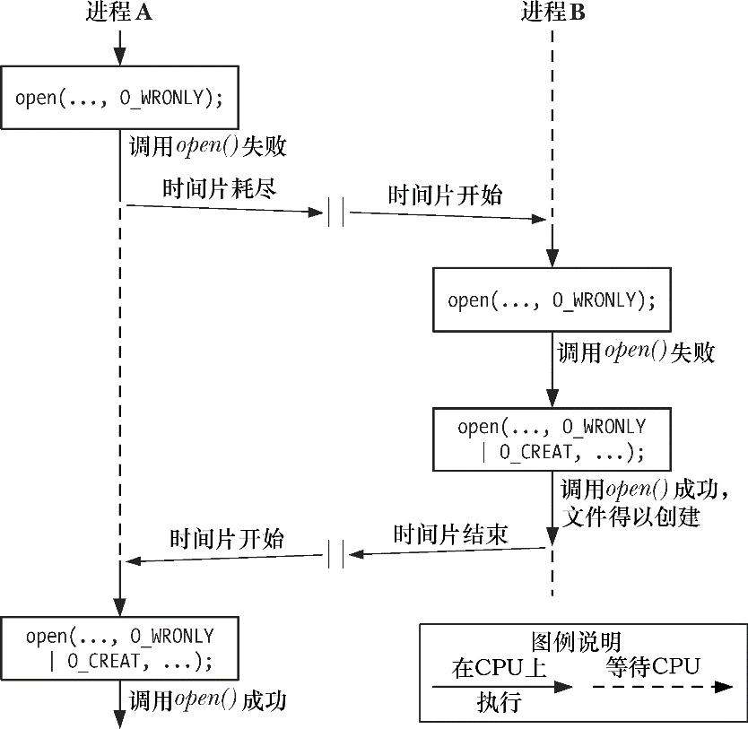
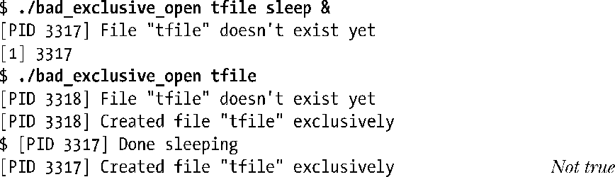

# 深入探究文件I/O

## [0x00]原子操作竞争条件

在探究系统调用时会反复涉及原子操作的概念。所有系统调用都是以原子操作方式执行的。之所以这么说，是指内核保证了某系统调用中的所有步骤会作为独立操作而一次性加以执行，其间不会为其他进程或线程所中断。

原子性是某些操作得以圆满成功的关键所在。特别是它规避了竞争状态（race conditions）（有时也称为竞争冒险）。竞争状态是这样一种情形：操作共享资源的两个进程（或线程），其结果取决于一个无法预期的顺序，即这些进程 获得CPU使用权的先后相对顺序。

接下来，将讨论涉及文件I/O的两种竞争状态，并展示了如何使用open()的标志位，来保证相关文件操作的原子性，从而消除这些竞争状态。

### 以独占方式创建一个文件

[FileIO]中曾述及：当同时指定O_EXCL与O_CREAT作为open()的标志位时，如果要打开的文件已然存在，则open()将返回一个错误。这提供了一种机制，保证进程是打开文件的创建者。对文件是否存在的检查和创建文件属于同一原子操作。要理解这一点的重要性，请思考下列程序所示代码，该段代码中并未使用O_EXCL标志。（在此，为了对执行该程序的不同进程加以区分，在输出信息中打印有通过调用getpid()所返回的进程号。）

```c
fd = open(argv[1], O_WRONLY);
if(fd != -1){
  printf("[PID %ld] File \"%s\" already exists\n", (long)getpid(), argv[1]);
  close(fd);
}else{
  if(errno != ENOENT){
    errExit("open");
  }else{
    /* WINDOW FOR FAILURE */
    fd = open(argv[1], O_WRONLY|O_CREAT, S_IRUSER|S_IWUSER);
    if(fd == -1){
      errExit("open");
    }
    printf("[PID %ld] Created file \"%s\" exclusively\n", (long)getpid(), argv[1]);
  }
}
```

上述程序中所示的代码，除了要啰啰嗦嗦地调用open()两次外，还潜伏着一个bug。假设如下情况：当第一次调用open()时，希望打开的文件还不存在，而当第二次调用open()时，其他进程已经创建了该文件。如图5-1所示，若内核调度器判断出分配给A进程的时间片已经耗尽，并将CPU使用权交给B进程，就可能会发生这种问题。再比如两个进程在一个多CPU系统上同时运行时，也会出现这种情况。下图展示了两个进程同时执行程序清单5-1中代码的情形。在这一场景下，进程A将得出错误的结论：目标文件是由自己创建的。因为无论目标文件存在与否，进程A对open()的第二次调用都会成功。



虽然进程将自己误认为文件创建者的可能性相对较小，但毕竟是存在的，这已然将此段代码置于不可靠的境地。操作的结果将依赖于对两个进程的调度顺序，这一事实也就意味着出现了竞争状态。

为了说明这段代码的确存在问题，可以用一段代码替换上述程序的注释行“处理文件不存在的情况”，在检查文件是否存在与创建文件这两个动作之间人为制造一个长时间的等待。

```c
printf("[PID %ld] File \"%s\" doesn't exist yet \n", (long)getpid(), argv[1]);
if(argc > 1){
  sleep(5);
  printf("[PID %ld] Done sleeping\n",(long)getpid());
}
```

sleep()库函数可将当前执行的进程挂起指定的秒数。

如果同时运行程序清单5-1中程序的两个实例，两个进程都会声称自己以独占方式创建了文件。




## [0x01]文件控制操作fcntl()

## [0x02]打开文件的状态标志

## [0x03]文件描述符和打开文件之间的关系

## [0x04]复制文件描述符

## [0x05]在文件特定偏移量处的I/O：pread()和pwrite()

## [0x06]分散输入和集中输出

## [0x07]截断文件

## [0x08]非阻塞I/O

## [0x09]大文件I/O

## [0x0A]/dev/fd目录

## [0x0B]创建临时文件