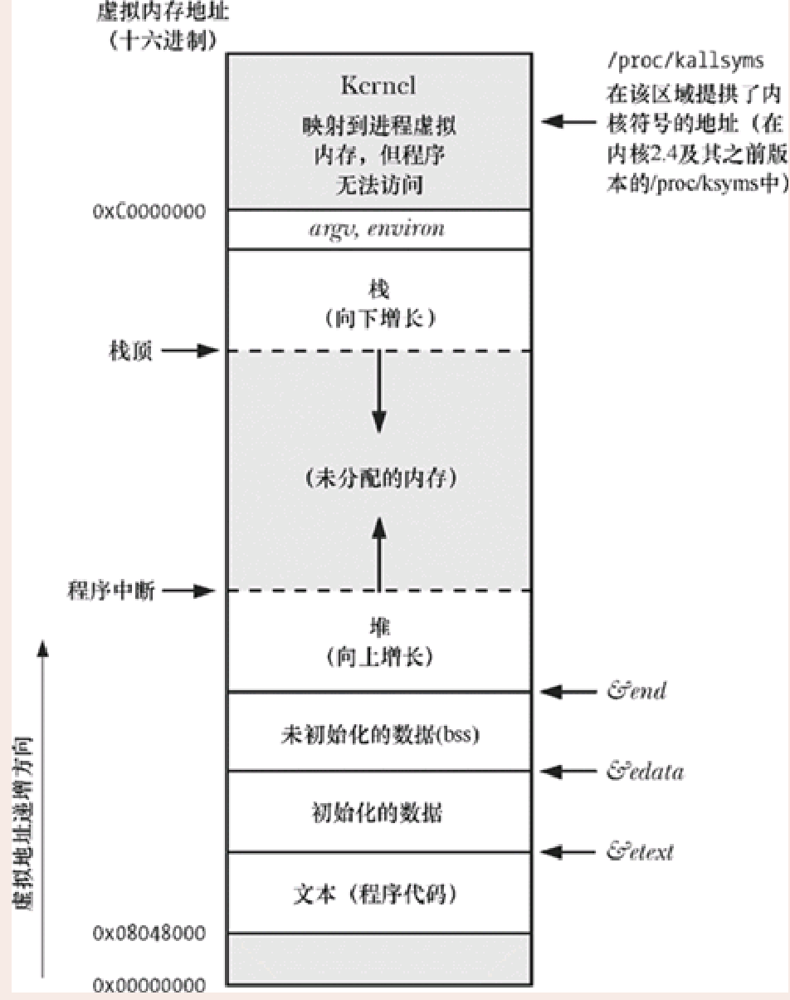
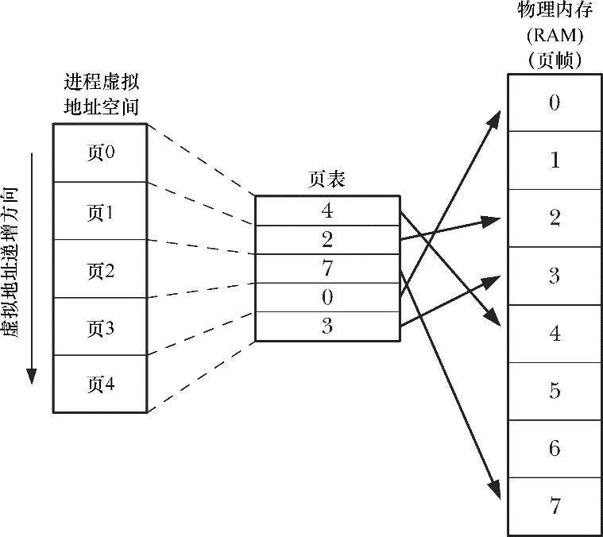

# 进程

## [0x00]进程和程序

进程(process)是一个可执行程序(program)的实例。本节将阐述进程定义，并澄清其与程序之间的区别。

程序是包含了一系列信息的文件，这些信息描述了如何在运行是创建一个进程，锁包括的内容如下所示。

-  二进制格式标识：每个程序文件都包含用于描述可执行文件格式的元信息(metainformation)。内核(kernel)利用此信息来解释文件中的其他信息。历史上，UNIX可执行文件曾有两种广泛使用的格式，分别为最初的a.out（汇编程序输出）和更加复杂的COFF(通用对象文件格式)。现在，大多数UNIX实现(包括Linux)采用可执行连接格式(ELF)，这一文件格式比老版本格式具有更多优点。
- 机器语言指令：对程序算法进行编码。
- 程序入口地址：标识程序开始执行时的其实指令位置。
- 数据：程序文件包含的变量初始值和程序使用的字面常量(literal constant)值(比如字符串)。
- 符号表及重定位表：描述程序中函数和变量的位置及名称。这些表格有多种用途，其中包括调试和运行时的符号解析(动态链接)。
- 共享库和动态链接信息：程序文件所包含的一些字段，列出了程序运行时需要使用的共享库，以及加载共享库的动态连接器的路径名
- 其他信息：程序文件还包含许多其他信息，用以描述如何创建进程。

可以用一个程序来创建许多进程，或者反过来说，许多进程运行的可以是同一程序。

在此将本节开始时给出的进程定义重新改写为，进程是有内核定义的抽象的实体，并为该实体分配用以执行程序的各项系统资源。

从内核角度看，进程由用户内存空间(user-space memory)和一系列内核数据结构组成，其中用户内存空间包含了程序代码及代码所使用的变量，而内核数据结构则用于维护进程状态信息。记录在内核数据结构中的信息包括许多与进程相关的符号(IDs)、虚拟内存表、打开文件的描述符表、信号传递及处理的有关信息、进程资源使用及限制、当前工作目录和大量的其他信息。

## [0x01]进程号和父进程号

每个进程都有一个进程号(PID)，进程号是一个正数，用以唯一标识系统中的某个进程。对各种系统调用而言，进程号有时可以作为传入参数，有事可以作为返回值。比如，系统调用kill()允许调用者向拥有特定进程而言唯一的标识符时，进程号就会派上用场。常见的例子是将进程号作为与进程相关文件名的一部分。

系统调用getpid()返回调用进程的进程号。

```c
#include <unistd.h>

pid_t getpid(void);
								Always successfully returns process ID of caller.
```

getpid()返回值的数据类型为pid_t，该类型是有SUSv3所规定的整数类型，专用于储存进程号。

除了少数系统进程外，比如init进程(进程号为1)，程序与运行该程序进程的进程号之间没有固定关系。

Linux内核限制进程号需要小于等于32767。新进程创建时，内核会按顺序将下一个可用的进程号分配给其使用。每当进程号大奥32767的限制时，内核将重置进程号计数器，以便从小整数开始分配。

一旦金超达到32767，会将进程号计数器重置为300，而不是1。之所以如此，是因为低数值的进程号为系统进程和守护进程所长期占用，在此范围内搜索尚未使用的进程号只会是浪费时间。

在Linux2.4版本及更早版本中，进程号的上限32767，由内核常量PID_MAX所定义。在Linux 2.6版本中，情况有所改变。尽管进程的默认上限仍是32767，但可以通过Linux系统特有的/proc/sys/kernel/pid_max文件来进行调整(其值=最大进程号-1)。在32位平台中，pid_max文件的最大值为32768，但在64位平台中，该文件的最大值可以高达到400万，系统可能容纳的进程数量会非常庞大。

每个进程都有一个创建自己的父进程。使用系统调用getppid()可以检索到父进程号。

```c
#include <unistd.h>

pid_t getppid(void);
			Always successfully returns process ID of parent of caller
```

实际上，每个进程的父进程号属性反映了系统上所有进程间的树状关系。每个进程的父进程又有自己的父进程，以此类推，回溯到1号进程——init进程，即所有进程的始祖。使用pstree(1)命令可以查看到这一“家族树”（family tree）。

如果子进程的父进程终止，则子进程就会变成“孤儿”，init进程随即将收养该进程，子进程后续对getppid()的调用将返回进程号1。

通过查看由Linux系统所特有的/proc/PID/status文件所提供的PPid字段，可以获知每个进程的父进程。

## [0x02]进程内存布局

每个进程所分配的内存由很多部分组成，通常称为"段(segment)"。

- 文本段包含了进程运行的程序机器语言指令。文本段具有只读属性，以防止进程通过错误指针意外修改自身指令。因为多个进程可同时运行同一程序，所以又将文本段设为可共享，这样，一份程序代码的拷贝可以映射到所有这些进程的虚拟地址空间中。

- 初始化数据段包含显式初始化的全局变量和静态变量。当程序加载到内存时，从可执行文件中读取这些变量的值。

- 未初始化数据段包含了未进行显式初始化的全局变量和静态变量。程序启动之前，系统将本段内所有内存初始化为0。出于历史原因，此段常被称为BSS段，这源于老版本的汇编语言助记符“block started by symbol”。将经过初始化的全局变量和静态变量与未经初始化的全局变量和静态变量分开存放，其主要原因在于程序在磁盘上存储时，没有必要为未经初始化的变量分配存储空间。相反，可执行文件只需记录未初始化数据段的位置及所需大小，直到运行时再由程序加载器来分配这一空间。

- 栈（stack）是一个动态增长和收缩的段，由栈帧（stack frames）组成。系统会为每个当前调用的函数分配一个栈帧。栈帧中存储了函数的局部变量（所谓自动变量）、实参和返回值。6.5节将深入讨论栈帧。
- 堆（heap）是可在运行时（为变量）动态进行内存分配的一块区域。堆顶端称作program break。

对于初始化和未初始化的数据段而言，不太常用、但表述更清晰的称谓分别是用户初始化数据段（user-initialized data segment）和零初始化数据段（zero-initialized data segment）。

size(1)命令可显示二进制可执行文件的文本段、初始化数据段、非初始化数据段（bss）的段大小。

正文中使用的术语“段（segment）”不应与一些硬件体系架构，比如x86-32中使用的硬件分段（segmentation）相混淆。相反，本文中的段是对UNIX系统中进程虚拟内存的逻辑划分。有时，会使用术语“区（section）”来替代段，因为在当下风行的可执行文件格式（ELF）规范中，采用的术语与“区”更趋一致。

本书会在多处涉及这种情况：库函数返回的指针指向静态分配的内存。这意味着，该内存既可在初始化数据段中分配，也可在非初始化数据段中分配。（某些情况下，库函数转而会在堆上对内存做一次性动态分配，然而，这一实现细节与这里所要表达的意思无关。）库函数有时会通过静态分配的内存来返回信息，了解这一情况至关重要，因为这片内存的存在独立于函数调用，后续对同一函数的调用可能会将其覆盖（有时，后续对相关函数的调用也有相同的效应）。使用静态分配的内存会使函数不可重入（nonreentrant）。21.1.2节和31.1节将深入讨论重入（reentrancy）问题。

程序清单6-1展示了不同类型的C语言变量，并以注释说明每种变量分属于哪个段。这些说明正确的前提是假定使用了非优化的编译器，且在应用程序二进制接口（ABI）中，是通过栈来传递所有参数的。实际上，优化编译器会将频繁使用的变量分配于寄存器中，或者索性将变量彻底剔除 。此外，一些ABI需要通过寄存器，而不是栈，来传递函数实参和结果。尽管如此，本例只是意在展示C语言变量和进程各段间的映射关系。

应用程序二进制接口（ABI）是一套规则，规定了二进制可执行文件在运行时应如何与某些服务（诸如内核或函数库所提供的服务）交换信息。ABI特别规定了使用哪些寄存器和栈地址来交换信息以及所交换值的含义，一旦针对某个特定ABI进行了编译，其二进制可执行文件应能在ABI相同的任何系统上运行。与之相反，标准化的API（如SUSv3）仅能通过编译源代码来保证应用程序的可移植性。

虽然SUSv3未作规定，但在大多数UNIX实现（包括Linux）中C语言编程环境提供了3个全局符号（symbol）：etext、edata和end，可在程序内使用这些符号以获取相应程序文本段、初始化数据段和非初始化数据段结尾处下一字节的地址。使用这些符号，必须显式声明如下：

```c
extern char etext, edata, end;
				/*For example, &etext gives the address of the end of 
				the program text / start of initialized data*/
```

下图展示了各种内存段在 x86-32 体系结构中的布局，该图的顶部标记为 argv、environ的空间用来存储程序命令行实参（通过C语言中main()函数的argv参数获得）和进程环境列表（稍后讨论），图中十六进制的地址会因内核配置和程序链接选项差异而有所不同。图中标灰的区域表示这些范围在进程虚拟地址空间中不可用，也就是说，没有为这些区域创建页表（page table）（参考以下关于虚拟内存管理的讨论）。



## [0x03]虚拟内存管理

上述关于进程内存布局的讨论忽略了一个事实：这一布局存在于虚拟内存中。因为对虚拟内存的理解将有助于后续对诸如fork()系统调用、共享内存和映射文件之类主题的阐述，所以这里将探讨一些有关虚拟内存的详细内容。

Linux，像多数现代内核一样，采用了虚拟内存管理技术。该技术利用了大多数程序的一个典型特征，即访问局部性（locality of reference），以求高效使用CPU和RAM（物理内存）资源。大多数程序都展现了两种类型的局部性。

空间局部性（Spatial locality）：是指程序倾向于访问在最近访问过的内存地址附近的内存（由于指令是顺序执行的，且有时会按顺序处理数据结构）。

时间局部性（Temporal locality）：是指程序倾向于在不久的将来再次访问最近刚访问过的内存地址（由于循环）。

正是由于访问局部性特征，使得程序即便仅有部分地址空间存在于RAM中，依然可能得以执行。

虚拟内存的规划之一是将每个程序使用的内存切割成小型的、固定大小的“页”（page）单元。相应地，将RAM划分成一系列与虚存页尺寸相同的页帧。任一时刻，每个程序仅有部分页需要驻留在物理内存页帧中。这些页构成了所谓驻留集（resident set）。程序未使用的页拷贝保存在交换区（swap area）内——这是磁盘空间中的保留区域，作为计算机RAM的补充—— 仅在需要时才会载入物理内存。若进程欲访问的页面目前并未驻留在物理内存中，将会发生页面错误（page fault），内核即刻挂起进程的执行，同时从磁盘中将该页面载入内存。

在x86-32中，页面大小为4096个字节。其他一些Linux实现使用的页面比4096个字节更大。例如，Alpha使用的页面大小为8192个字节，IA-64使用的页面大小是可变的，默认为16384个字节。程序可调用sysconf(_SC_PAGESIZE)来获取系统虚拟内存的页面大小，具体参见11.2节的描述。

为支持这一组织方式，内核需要为每个进程维护一张页表（page table）（见图6-2）。该页表描述了每页在进程虚拟地址空间（virtual address space）中的位置（可为进程所用的所有虚拟内存页面的集合）。页表中的每个条目要么指出一个虚拟页面在RAM中的所在位置，要么表明其当前驻留在磁盘上。



在进程虚拟地址空间中，并非所有的地址范围都需要页表条目。通常情况下，由于可能存在大段的虚拟地址空间并未投入使用，故而也无必要为其维护相应的页表条目。若进程试图访问的地址并无页表条目与之对应，那么进程将收到一个SIGSEGV信号。

由于内核能够为进程分配和释放页（和页表条目），所以进程的有效虚拟地址范围在其生命周期中可以发生变化。这可能会发生于如下场景。

- 由于栈向下增长超出之前曾达到的位置。

  

- 当在堆中分配或释放内存时，通过调用brk()、sbrk()或malloc函数族来提升program break的位置。

- 当调用shmat()连接System V共享内存区时，或者当调用shmdt()脱离共享内存区时。

- 当调用mmap()创建内存映射时，或者当调用munmap()解除内存映射时。

虚拟内存的实现需要硬件中分页内存管理单元（PMMU）的支持。PMMU把要访问的每个虚拟内存地址转换成相应的物理内存地址，当特定虚拟内存地址所对应的页没有驻留于RAM中时，将以页面错误通知内核。

虚拟内存管理使进程的虚拟地址空间与RAM物理地址空间隔离开来，这带来许多优点。

- 进程与进程、进程与内核相互隔离，所以一个进程不能读取或修改另一进程或内核的内存。这是因为每个进程的页表条目指向RAM（或交换区）中截然不同的物理页面集合。

- 适当情况下，两个或者更多进程能够共享内存。这是由于内核可以使不同进程的页表条目指向相同的RAM页。内存共享常发生于如下两种场景。

  - 执行同一程序的多个进程，可共享一份（只读的）程序代码副本。当多个程序执行相同的程序文件（或加载相同的共享库）时，会隐式地实现这一类型的共享。

  - 进程可以使用shmget()和mmap()系统调用显式地请求与其他进程共享内存区。这么做是出于进程间通信的目的。

- 便于实现内存保护机制；也就是说，可以对页表条目进行标记，以表示相关页面内容是可读、可写、可执行亦或是这些保护措施的组合。多进程共享RAM页面时，允许每个进程对内存采取不同的保护措施。例如，一个进程可能以只读的方式访问某个页面，而另一个进程则以读写的方式访问同一页面。
- 程序员和编译器、链接器之类的工具无需关注程序在RAM中的物理布局。
- 因为需要驻留在内存中的仅是程序的一部分，所以程序的加载和运行都很快。而且，一个进程锁占用的内存(即虚拟内存大小)能够超出RAM容量。

虚拟内存管理的最后一个优点是：由于每个进程使用的RAM减少了，RAM中同时可以容纳的进程数量就增多了。这增大了如下事件的概率：在任一时刻，CPU都可执行至少一个进程，因而往往也会提高CPU的利用率。

## [0x04]栈和栈帧

函数的调用和返回是栈的增长和收缩呈线性。X86-32体系架构之上的Linux(和多数其他Linux和UNIX实现)，栈驻留在内存的高端并向下增长(朝堆的方向)。专用寄存器：栈指针(stack pointer)，用于跟踪当前栈顶。每次调用函数时，会在栈上新分配一帧，每当函数返回时，再从栈上将此帧移去。

虽然栈向下增长，但仍将栈的增长端成为栈顶，因为抽象的说来，情况本来就如此。栈的实际增长方向是个(属于硬件范畴的)实现细节。在HP PA-RISC的Linux实现中，栈的增长方向就是向上的。

就虚拟内存而言，分配栈帧后，栈段的大小将会增长，但在大多数(Linux)实现中，释放这些栈帧后，栈的大小并未减少(在分配新的栈帧时，会对这些内存重新加以利用)。当谈论栈段的增长和收缩时，只是从逻辑视角来看待栈帧在栈中的增减情况。

有时，会用用户栈(user stack)来表示此处所讨论的栈，以便与内核栈区分开来。内核栈是每个进程保留在内核内存中的内存区域，在执行系统调用的过程中供(内核)内部函数调用使用。(由于用户栈驻留在不受保护的用户内存中，所以内核无法利用用户栈来达成这一目的)

每个(用户)栈帧包括如下信息。

- 函数实参和局部变量：由于这些变量都是在调用函数时自动创建的，因此在C语言中称其为自动变量。函数返回时将自动销毁这些变量(因为栈帧会被释放)，这也是自动变量与静态(以及全局)变量主要的语义区别：后者与函数执行无关，且长期存在。

- (函数)调用的链接信息：每个函数都会用到一些CPU寄存器，比如程序计数器，其指向下一条要执行的机器语言指令。每当一函数调用另一函数时，会在被调用函数的栈帧中保存这些寄存器的副本，以便函数返回时能为函数调用者将寄存器回复原状。

因为函数能够嵌套调用

## [0x05]命令行参数(argc，argv)

## [0x06]环境列表

## [0x07]执行非局部跳转

